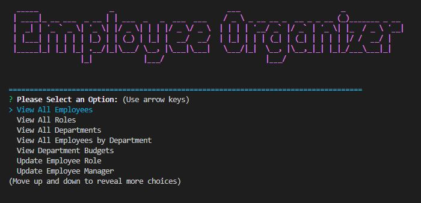
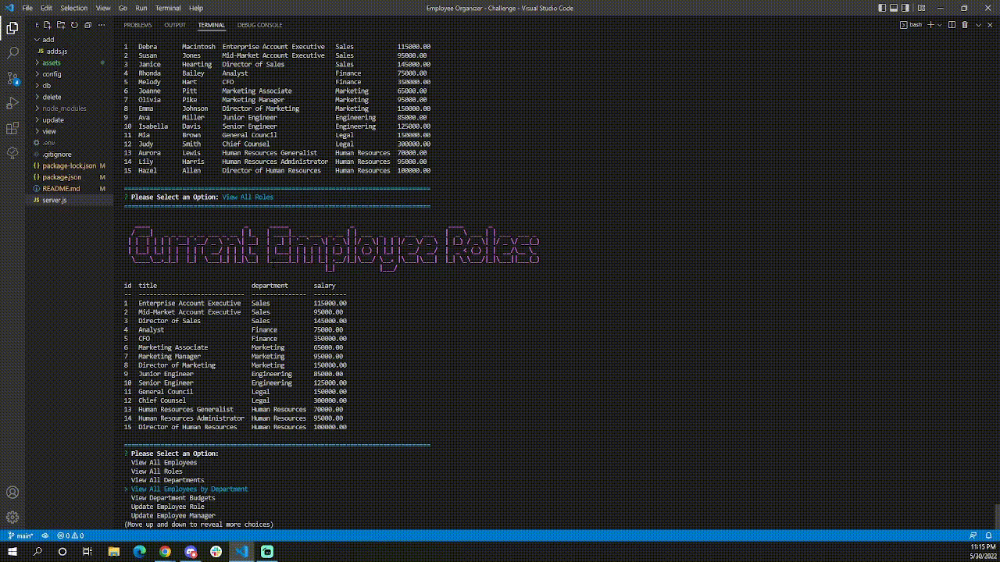

# Employee Organizer

## Description:
Organizing your employee/company information could never be easier with the new Employee Organizer! Utilize a inquirer prompt with mysql to view/update/add/remove Employees with ease!

## Tables of Contents:
* [Technologies](#technologies)
* [NPM Packages](#npm-packages)
* [Screenshot](#screenshot)
* [Installation](#installation)
* [Usage](#usage)
* [Author(s)](#authors)
* [Contact Info](#contact-info)

## Technologies:
* JavaScript
* JQuery
* Node.js (npm)

## NPM Packages:
* [chalk v4.1.2](https://www.npmjs.com/package/chalk/v/4.1.2)
* [console.table v0.10.0](https://www.npmjs.com/package/console.table)
* [dotenv v16.0.1](https://www.npmjs.com/package/dotenv)
* [figlet v1.5.2](https://www.npmjs.com/package/figlet)
* [inquirer v8.2.4](https://www.npmjs.com/package/inquirer)
* [mysql2 v2.3.3](https://www.npmjs.com/package/mysql2)
* [validator v13.7.0](https://www.npmjs.com/package/validator)

## Screenshot:
Starting Screen:

Example Gif:

[Tutorial Video Here](https://youtu.be/831qH15nBGw)

## Installation:
Download the available Zip file or clone to your local machine. Open terminal and run the following commands:

`npm init`

`npm install chalk@4.1.2`

`npm install console.table dotenv figlet inquirer mysql2 validator`

Create a `.env` file with `DB_NAME`, `DB_USER`, `DB_PASSWORD` as single lines each, set to contain your senitive information in single quotes.

    *If you'd like to seed your database with populated information do the following steps:*

    Type `mysql -u *insert username here* -p` then enter in your password for mySQL.

    once the mysql prompt is active use the following commands IN ORDER:

    `source db/db.sql`

    `source db/schema.sql`

    `source db/seeds.sql`

Once you are ready to run the application use command:

`npm start`

## Author(s):
* Jeffrey Young

## Contact Info:
[GitHub](https://github.com/jeffymiyoung)

---
© 2022 Company Accounts Page Generator